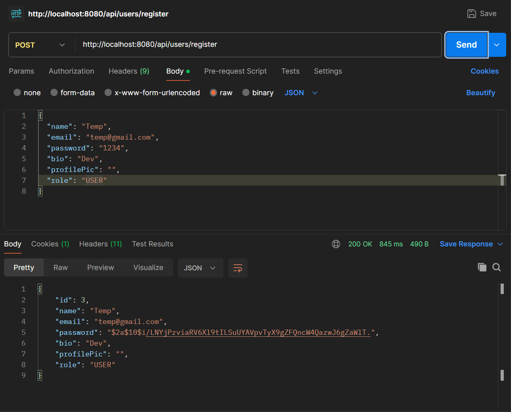
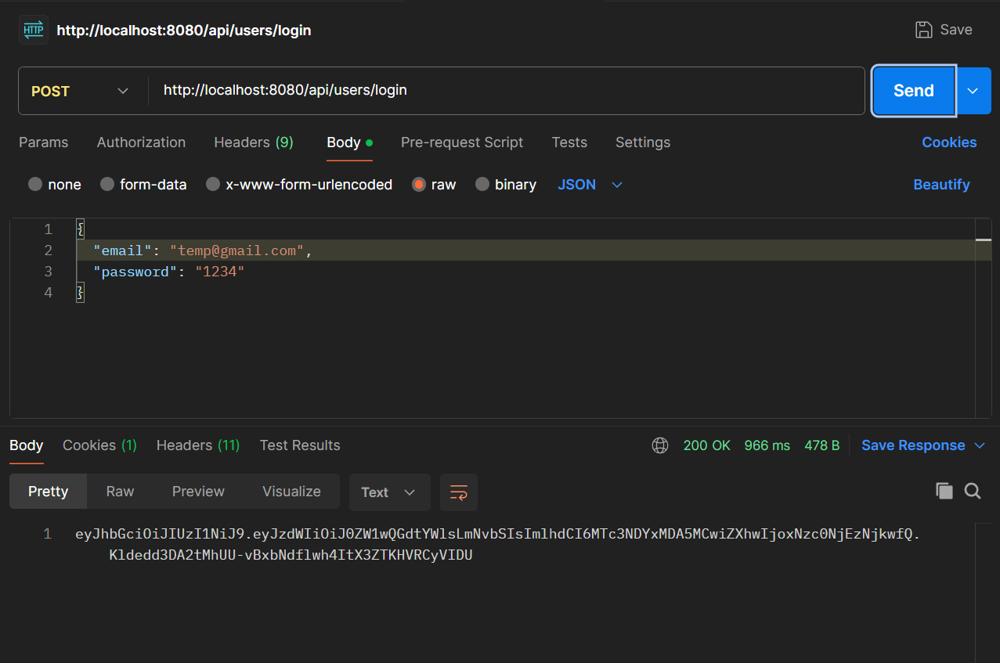
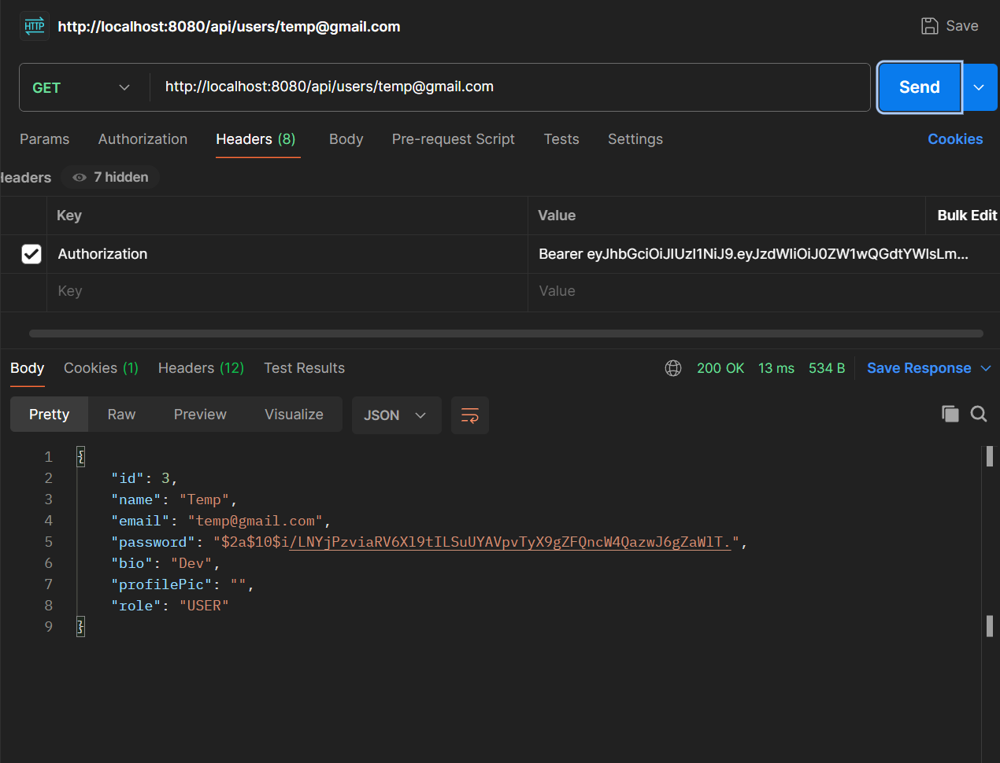
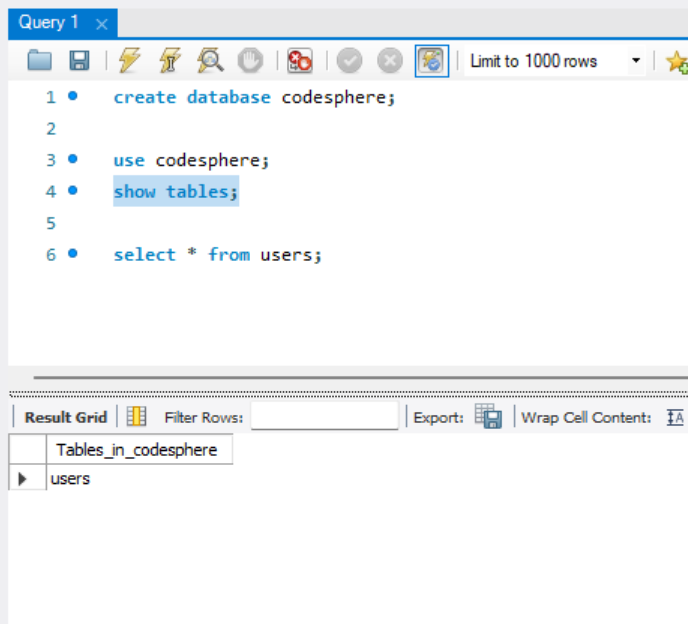

# CodeSphere Backend

CodeSphere is a full-stack social platform for developers. This repository contains the backend built using Spring Boot with secure authentication and REST APIs.

---

## Tech Stack

- Java
- Spring Boot
- Spring Web
- Spring Data JPA (Hibernate)
- Spring Security
- JWT Authentication
- MySQL
- Maven
- Lombok

---

## 📸 Workflow & Screenshots

### 🔹 User Registration (Postman)

---

### 🔹 User Login (JWT Token)

---

### 🔹 Protected API (JWT Working)

---

### 🔹 MySQL Database (Users Table)

---

## Features

- User Registration
- User Login with JWT Authentication
- Password Encryption using BCrypt
- Protected APIs using Spring Security
- MySQL Database Integration
- Clean Architecture (Controller → Service → Repository)

---

## Project Structure
backend/
├── src/main/java/com/codesphere/backend
│ ├── controller/
│ ├── service/
│ ├── repository/
│ ├── entity/
│ ├── security/
│ ├── config/
│ └── BackendApplication.java
│
├── src/main/resources/
│ └── application.properties
│
├── pom.xml

---

## Setup Instructions

### 1. Clone Repository

### 2. Configure MySQL

Open MySQL Workbench and run:

CREATE DATABASE codesphere;

### 3. Update application.properties
spring.datasource.url=jdbc:mysql://localhost:3306/codesphere
spring.datasource.username=YOUR_USERNAME
spring.datasource.password=YOUR_PASSWORD

spring.jpa.hibernate.ddl-auto=update
spring.jpa.show-sql=true

### 4. Run Backend
mvn spring-boot:run

Server runs at:
http://localhost:8080

---

## API Endpoints

Register User:
POST /api/users/register

Login (Returns JWT):
POST /api/users/login

Get User (Protected):
GET /api/users/{email}

---

## JWT Usage

Add token in request header:

Authorization: Bearer YOUR_TOKEN

---

## Key Concepts Used
JWT Token Authentication
BCrypt Password Encryption
Layered Architecture
REST API Design
Dependency Injection

---

## Future Enhancements
Posts / Feed system
Like & Comment features
Notifications
Search & Filters
Admin Dashboard

---

## Author

Kanishk Marwal